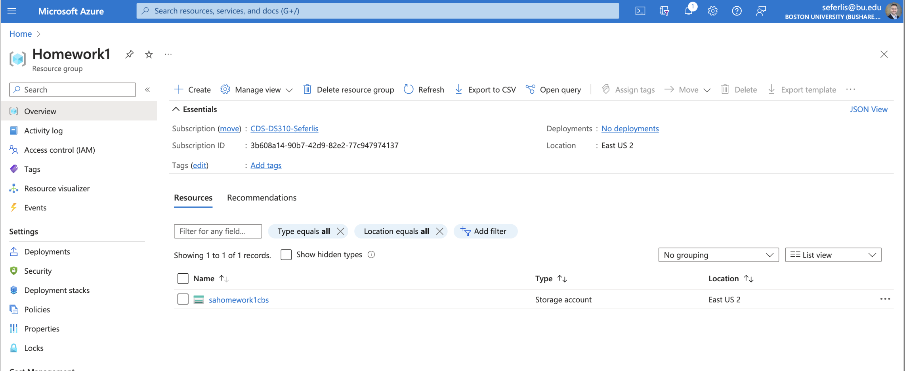

# Homework 1: Azure Account

Welcome to Homework 1! This assignment introduces you to the Microsoft Azure platform, where you’ll set up your student account, create a resource group, and establish a storage account that will serve as a foundational element for upcoming assignments.

## Overview
In this assignment, you will:
1. Set up a Microsoft Azure student account.
2. Create a resource group in Azure.
3. Create a storage account within your resource group, which we’ll use for future data storage needs.

Please follow the steps carefully and use the provided links for guidance on each section.

---

## Instructions

### Step 1: Create a Student Account in Azure

To access Azure resources, you’ll need to set up a Microsoft Azure student account. This will give you free access to essential Azure services, which you’ll use throughout the course.

1. Visit the [Azure for Students page](https://azure.microsoft.com/en-us/free/students/).
2. Click on **Activate Now**.
3. Register using your `@bu.edu` email address to ensure you receive student benefits.
4. Complete the registration process as prompted on the Azure website.

**Note**: If you experience any issues during sign-up, refer to the FAQ section on the Azure page for troubleshooting tips.

### Step 2: Create a Resource Group

Azure Resource Groups allow you to organize and manage resources like virtual machines, databases, and storage accounts. For this assignment, you’ll create a new resource group that will contain all related resources.

1. Log in to your Azure student account.
2. Go to the [Azure Portal](https://portal.azure.com/).
3. Follow this guide to create a new resource group: [How to Create an Azure Resource Group](https://www.educative.io/answers/how-to-create-an-azure-resource-group-from-the-azure-portal).

### Resource Group Requirements:
- **Name**: Choose a meaningful name, like `StudentResources_Group` or `YourName_Group`.
- **Region**: Select a region close to you or one recommended by Azure.

### Step 3: Create a Storage Account

The storage account will be used for data storage in future assignments, serving as a data lake to manage and analyze data.

1. In the Azure Portal, navigate to the **Resource Group** you just created.
2. Use this article to guide you in creating a storage account within your resource group: [Create an Azure Storage Account](https://learn.microsoft.com/en-us/azure/storage/common/storage-account-create?tabs=azure-portal).

### Storage Account Requirements:
- **Name**: Choose a unique name for your storage account, such as `StudentDataStorage`.
- **Region**: Select the same region as your resource group.
- **Performance**: Choose **Standard**.
- **Replication**: Select **Locally-redundant storage (LRS)**, which is sufficient for this course.

---

## Verification and Submission

Upon completion, submit the following as proof of your work:

1. **Screenshot of the Storage Account** within the resource group.
   - 

Save the screenshots as `.png` or `.jpg` files and upload them through the course submission portal for Homework 1.

---

## Helpful Tips

- Azure’s interface may change over time. If something doesn’t look exactly like the guides, look for similar options or refer to Azure’s documentation.
- Keep track of the names you give your resources, as you’ll need them for future assignments.
- Azure provides $100 in free credits with your student account—be mindful of your usage to stay within this limit.

---

Enjoy exploring Azure, and happy learning!