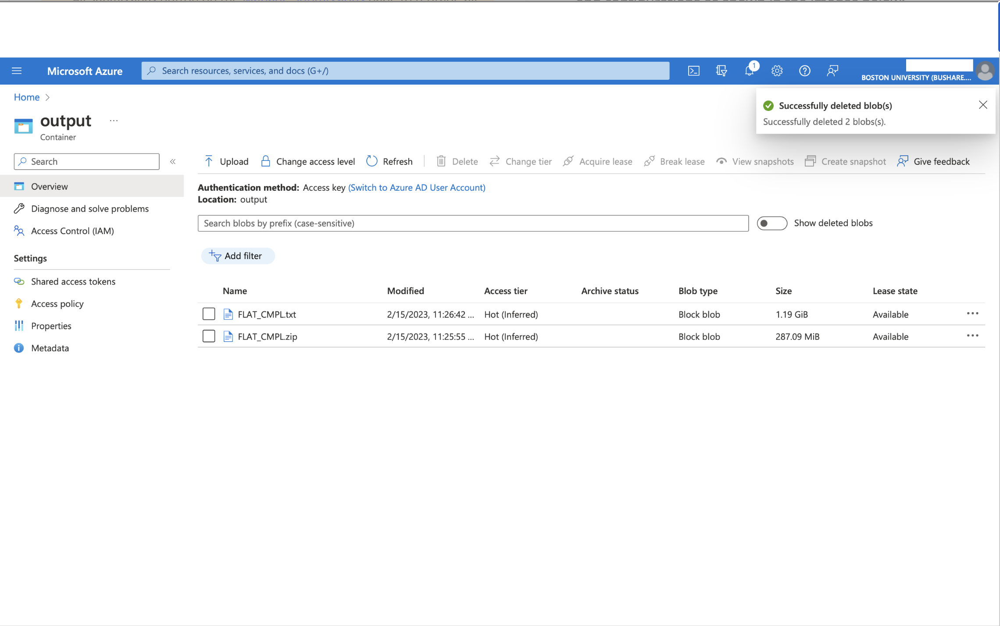
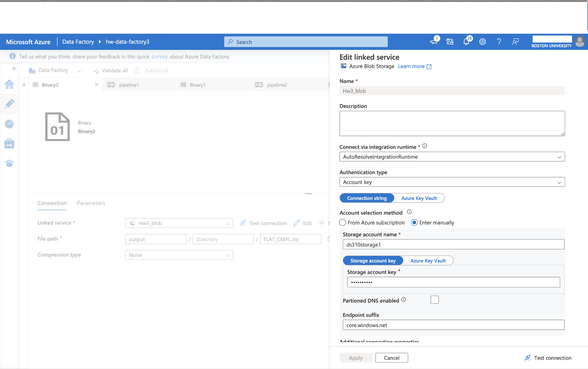
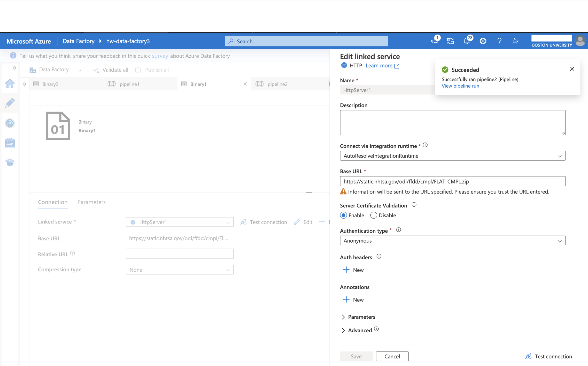

# Homework 2 - Extract & Load

**Let the games begin!**

This homework assignment requires thoughtful planning and execution, so avoid procrastination. If you aspire to a tech career, this should be an enjoyable challenge—much more engaging than American Literature or Sociology!

## Assignment Overview
For this assignment, you will be working with the National Highway Traffic Safety Administration (NHTSA) "Complaints" data. Your goal is to extract, load, and prepare this data using Azure Data Factory (ADF). You will:

1. **Extract**: Download the data file from the provided NHTSA link.
2. **Load**: Transfer the file to a newly created Azure Storage account (blob type) using Azure Data Factory.
3. **Unzip**: Extract the file contents into a `.txt` file using ADF.

> **Important**: All steps must be completed using Azure Data Factory tools—manual operations are not allowed.

## Instructions

### Step-by-Step Guide
1. **Set Up Azure Data Factory**:
   - Ensure that you have access to an Azure subscription and have created an Azure Data Factory instance.
   - Follow this guide to get started: [Getting Started with Azure Data Factory](https://learn.microsoft.com/en-us/azure/data-factory/quickstart-create-data-factory)

2. **Extract the Data**:
   - Use Azure Data Factory to create a pipeline that extracts the data from the `Complaints` data source.
   - The data is available at the following link: [Complaints Data File](https://static.nhtsa.gov/odi/ffdd/cmpl/FLAT_CMPL.zip)
   - Hint: Treat the data source as an HTTPS-linked dataset within ADF.

3. **Load the Data**:
   - Create a new Azure Storage account with blob storage enabled.
   - Use ADF's copy activity to transfer the `.zip` file from the HTTPS source to your Azure Storage container.
   - Reference: [How to Create a Storage Account](https://learn.microsoft.com/en-us/azure/storage/common/storage-account-create?tabs=azure-portal)

4. **Unzip the File**:
   - Use ADF's built-in tools to unzip the file within the pipeline. Ensure that the extracted content is in `.txt` format and stored in your Azure Storage account.
   - Follow tutorials and documentation from Microsoft for guidance on data transformation and extraction.

### Reference Files and Tutorials
- **NHTSA Complaints Data Information**: [Complaints Information](https://www.nhtsa.gov/nhtsa-datasets-and-apis#complaints)
- **Complaints Reference File**: [Reference Document](https://static.nhtsa.gov/odi/ffdd/cmpl/Import_Instructions_Excel_All.pdf)

## Using Deployment Template
For any resource deployment, use the following command. Replace placeholders with your specific resource group and file paths:

```azurecli-interactive
az deployment group create --resource-group <resource-group-name> --template-file <path-to-template.json> --parameters @<path-to-parameters.json>
```

---

## Verification and Submission

Upon completion, submit the following as proof of your work:

1. **Screenshot of the data file extracted in the storage account** 
   - 

2. **Screenshot of the Azure Blob Storage Linked Service**
   - 

3. **Screenshot of the HTTP Linked Service**
   - 

Save the screenshots as `.png` or `.jpg` files and upload them through the course submission portal for Homework 1.

---

### Key Points to Consider 🤔
- How will you handle the HTTPS source in your pipeline?
- What is the best approach to ensure the `.zip` file is unzipped automatically within ADF?
- How will you verify the integrity and structure of the `.txt` file once it’s extracted?

Ensure you complete all steps and verify that your data has been properly extracted and loaded into your Azure Storage account. Reach out for assistance if needed, and don’t hesitate to explore additional resources and tutorials.

Good luck, and enjoy the challenge!
