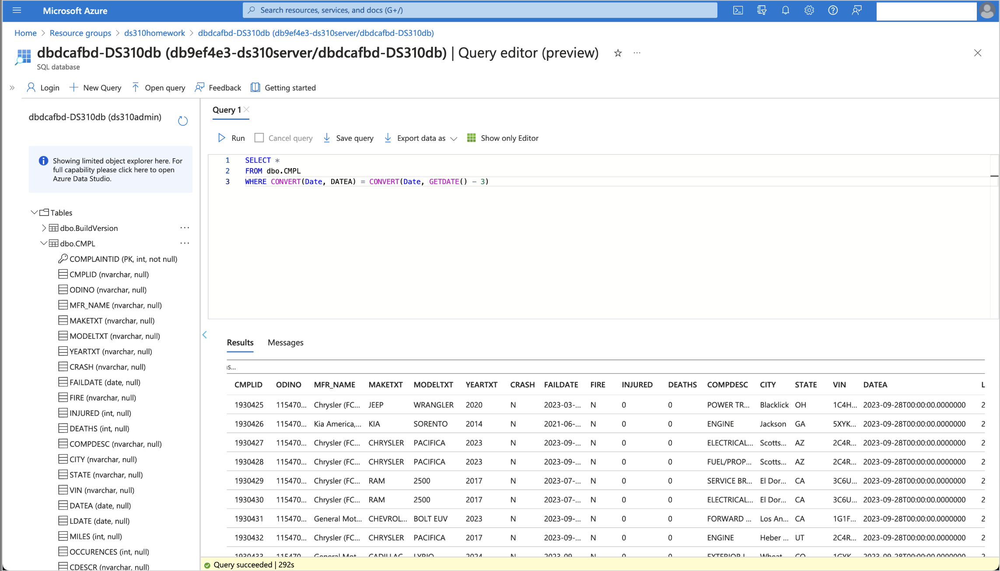

# Homework 3 - Transforming and Staging

**Class,**

> **NOTE** - Homework 3 builds upon Homework 2 (Extract and Load). You will be using the same `resource group` and `data-factory` from the previous assignment. If you did not complete Homework 2, please reach out to TA Office Hours for assistance before starting this assignment.

In Homework 2, you extracted and loaded a data file into your storage account. For Homework 3, you will extend that work by transforming and staging data from a `.txt` file into a SQL Server database table. Refer to the [reference document](https://static.nhtsa.gov/odi/ffdd/cmpl/Import_Instructions_Excel_All.pdf) for details on datatypes and fields.

## Assignment Overview
Using your existing Data Factory, you will:

1. **Transform**: Convert the `DateA` column datatype from text to date.
2. **Stage**: Load the transformed data into a database table named `<initials>Complaints` within a SQL Server database.

## Steps to Complete Homework 3

### Step 1: Set Up Your SQL Server and Database
If you previously used the `bash fromTemplate.sh` script for creating your SQL Server, skip to **Step 3**. Otherwise, follow these instructions:

1. **Create an Azure SQL Server with a Sample Database**:
   - Read the [full instructions](https://learn.microsoft.com/en-us/azure/azure-sql/database/single-database-create-quickstart?view=azuresql&tabs=azure-portal).
   - **Resource Group**: Use the same resource group from Homework 2.
   - **Database Name**: Use `<initials>omdsmod4db`. If using the script, `<initials>` may be randomized.
   - **Region**: Choose a region close to your current location.
   - **Admin Login**: Use `<first initial><last name>` (e.g., `jdoe`) and keep your password secure (default is `omdsmod4password013!` if using the script).
   - **Server Name**: Use `<initials>omdsmod4server` (lowercase). If using the script, the server name will start with `db<random-string>`.
   - **Workload Environment**: Select "Development".
   - **Compute and Storage**: Configure as follows:
     - **Service Tier**: Standard (S0)
     - **DTUs**: 10 DTUs
     - **Storage**: 250 GB
     - Expected cost: ~$14.72/month.
   - **Backup Storage**: Choose "Locally Redundant Storage".
   - **Firewall Rules**: Select "Yes" for both options.
   - **Trial Option**: Do not opt for the free trial.
   - **Deployment Time**: Expect 5-10 minutes for deployment.

### Step 2: Create Your Database Table
Use the `Complaints Reference File` to set up your table attributes with the correct data types. It is recommended to use `NVARCHAR` for text columns to handle Unicode characters.

### Step 3: Load Data with Azure Data Factory
1. Use Azure Data Factory to create a pipeline that includes:
   - **Transformation**: Convert the `DateA` column from text to a date format.
   - **Loading**: Transfer the data into the `<initials>Complaints` table.

### Step 4: Query and Export Results
After loading the data, run the following query in your SQL Server:

```sql
SELECT *
FROM cbsComplaints
WHERE CONVERT(Date, DATEA) = CONVERT(Date, GETDATE() - 1)
```

Output the results to a file and save it as a PDF for submission.

## Reference Documents and Tools
- [Getting Started with Azure Data Factory](https://learn.microsoft.com/en-us/azure/data-factory/quickstart-create-data-factory)
- [Creating a Storage Account](https://learn.microsoft.com/en-us/azure/storage/common/storage-account-create?tabs=azure-portal)
- [Creating a Database in Azure SQL Server Using Your Existing SQL Server](https://learn.microsoft.com/en-us/azure/azure-sql/database/single-database-create-quickstart?view=azuresql&tabs=azure-portal)
- [Creating a Table in an Azure SQL Database](https://www.edureka.co/community/62364/how-to-create-table-in-azure-sql-database)
- [Complaints Data File](https://static.nhtsa.gov/odi/ffdd/cmpl/FLAT_CMPL.zip)
- [Complaints Reference File](https://static.nhtsa.gov/odi/ffdd/cmpl/Import_Instructions_Excel_All.pdf)
- [Copy Tool](https://docs.microsoft.com/en-us/azure/data-factory/copy-activity-overview)
- [Data Flow](https://docs.microsoft.com/en-us/azure/data-factory/concepts-data-flow-overview)

---

## Verification and Submission

Upon completion, submit the following as proof of your work:

1. **Screenshot of Query Execution in Azure SQL Database** 
   - 

Save the screenshots as `.png` or `.jpg` files and upload them through the course submission portal for Homework 1.

---

## Points to Consider 🤔
- How do you use the `Complaints Reference File` to create a table in Azure SQL Database?
- How do you use the `Copy Tool` to load data from Azure Storage to Azure SQL Database?
- How do you handle rows with missing values?
- What if the header column names differ from table column names?
- What is the current format of the file, the delimiter, and the number of columns?
- How do you map columns and change their data types?

## Deployment Using Template
Use the following command to deploy resources:

```azurecli-interactive
az deployment group create --resource-group <resource-group-name> --template-file <path-to-template.json> --parameters @<path-to-parameters.json>
```

---

Ensure you understand each step and reach out with any questions!
