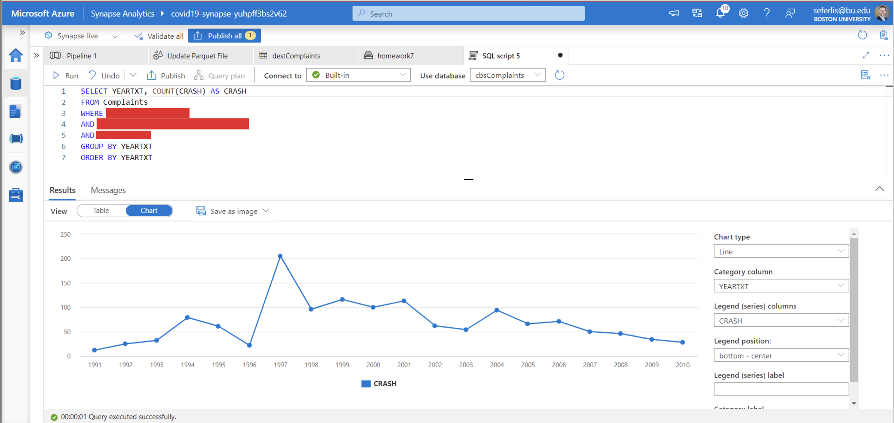

# Homework 3b: Synapse SQL Script, External Table Creation, and Data Visualization

In Homework 3b, you will connect to the `.parquet` file created in Homework 3a, mount it as an external table in your Azure Synapse Serverless Pool, and in Homework 3c visualize the data using PowerBI. This assignment will require setting up proper permissions for your Azure Storage account, ensuring the correct configuration of your `.parquet` file, and running queries to produce a visual representation of the data. In Homework 3c, you will then connect to your Synapse environment from PowerBI and visualize the data you've been working with.

## Objective
Create an external table in Azure Synapse, use Synapse SQL scripts to read `.parquet` files, and visualize the queried data.

## Tasks

### 1. Set Up ACL Permissions and Synapse Administration

- **Set Access Control List (ACL) Permissions**:
  - Configure ACL permissions for your storage account container where the `.parquet` file is stored.
  - Ensure that read, write, and execute permissions are granted to your email address associated with the assignment.
  - Use this [resource](https://learn.microsoft.com/en-us/azure/storage/blobs/data-lake-storage-acl-azure-portal) for guidance on setting up ACL permissions.

- **Assign Synapse Administrator Permissions**:
  - In Azure Synapse Studio, navigate to ‘Manage’, select ‘Access Control’, and assign yourself ‘Synapse Administrator’ permissions to manage resources effectively.

### 2. Create an External Table

- **Navigate to the ‘Data’ Hub**:
  - Go to the ‘Data’ section in Azure Synapse Studio and locate the option to create an external table.

- **Create the External Table**:
  - Use the [Azure Synapse Analytics documentation](https://learn.microsoft.com/en-us/azure/synapse-analytics/sql/develop-tables-external-tables?tabs=hadoop) as a reference.
  - Link the external table to the `.parquet` file containing the NHTSA data.
  - Ensure that the schema of the external table matches the structure of your `.parquet` file to avoid errors.

### 3. Execute SQL Queries on Parquet Files

- **Write and Run SQL Scripts**:
  - Use the SQL script editor in Synapse Studio to create and execute queries on the external table.
  - Confirm that the SQL queries accurately address and query data from the `.parquet` files.

### 4. Data Analysis

- **Extract Specific Data**:
  - Focus on extracting crash data for the Ford F-150 from 1990 to 2010.
  - Your query should filter the data based on the model (`Ford F-150`) and use a `WHERE` clause with the `BETWEEN` keyword for the year range. Refer to the [BETWEEN clause documentation](https://learn.microsoft.com/en-us/sql/t-sql/language-elements/between-transact-sql?view=sql-server-ver16) for more details.
  - **Note**: Ensure that the year column's datatype is numerical; non-numerical datatypes will cause issues when filtering by year.

### 5. Create a Data Visualization

- **Generate a Plot**:
  - Use the query results to create a visual representation of the data.
  - This can be a bar chart or line graph that displays the number of crashes per year.

## Submission

> Submit the following as proof of your work:

**IMPORTANT:** Ensure your BU account information is visible in the top right corner of your screenshots for verification.

1. **What your SQL Query and Plot should look like**:
   - 
   - If not? Make sure to check in with the LFs for support.

Follow all steps thoroughly and reach out for support if needed. Good luck, and enjoy exploring data with Azure Synapse!
