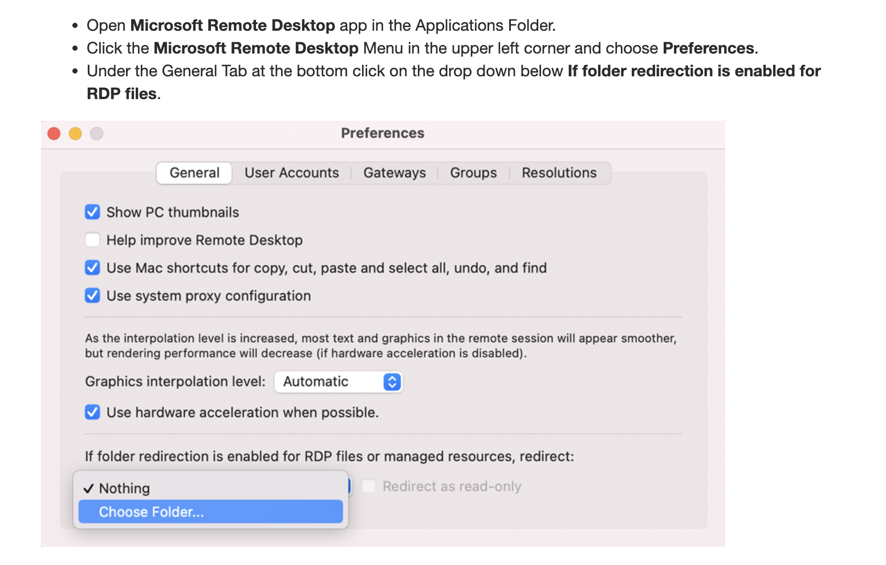

# THIS IS A DRAFT - PLEASE DO NOT START THIS HOMEWORK

# Homework 8: Microsoft Power BI

## Objective
The purpose of this homework is to familiarize you with the **fundamentals of Power BI**. By the end of this assignment, you will have developed key data visualization skills, an essential capability for any data analyst.
In Homework 3c, you will connect to your Synapse environment from PowerBI and visualize the data you've been working with on Homework 3a and 3b.

## Tasks

### 1. Access Power BI
#### Windows Users
- **Windows users** should download and install Power BI Desktop on their local machine for use.

#### Mac Users
- **Mac users** can access Power BI via **Azure Virtual Desktop** using the **Windows App**. Follow this guide for setup: [Azure Virtual Desktop Connection for macOS](https://learn.microsoft.com/en-us/windows-app/get-started-connect-devices-desktops-apps).

- **Configure Folder Redirection** to enable access to local folders on your virtual machine:
  - Refer to the following tutorial for folder redirection: [Folder Redirection Guide](https://bowdoin.teamdynamix.com/TDClient/1814/Portal/KB/ArticleDet?ID=132977).
   - 
   - 

### 2. Create a Power BI Report
Refer to the [Power BI Report Creation Tutorial](https://learn.microsoft.com/en-us/power-bi/create-reports/desktop-dimensional-model-report) for assistance.

- **Step 1: Get the Data from Azure Synapse**
  - Navigate to the PowerBI app on the Windows App
  - Click 'Get data from another source ->'
  - Select 'Azure Synapse Analytics SQL'
  - **How to find the Server name**
    - Navigate to Azure Synapse and find the 'Serverless SQL endpoint'
    - Copy and paste as an input for 'Server'
  - 'Import' for Data Connectivity Mode
  - Select 'Microsoft Account' and login to your Azure account
  - Load the external table from Homework 3c.

- **Step 2: Create your own Power BI Report**
  - Your report should consist of the following features (Your homework submission will be graded based on whether you fulfilled these requirements):
    1. 

## Submission

> Submit the following as proof of your work:

**IMPORTANT:** Ensure your BU account information is visible in the top right corner of your screenshots for verification.

1. 

Good luck, and enjoy building your Power BI report!
