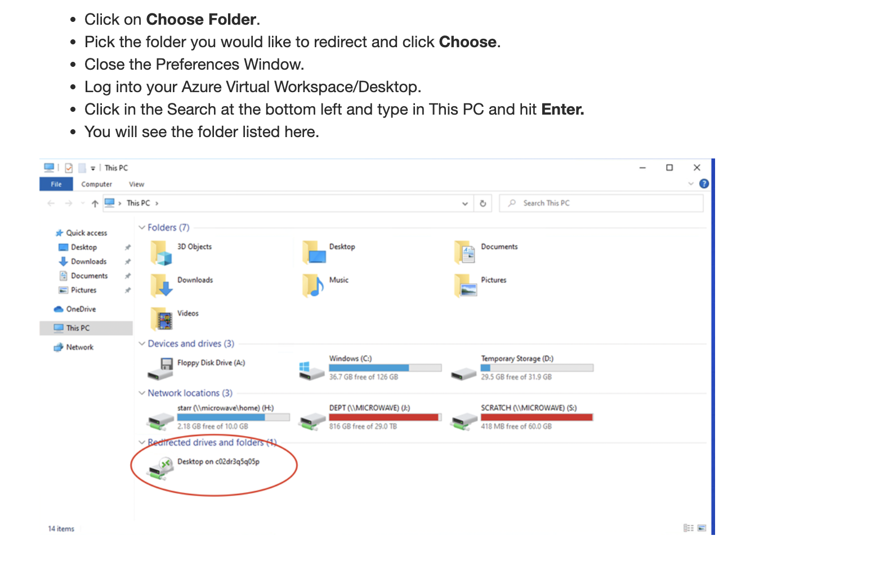

# THIS IS A DRAFT - PLEASE DO NOT START THIS HOMEWORK

# Homework 8: Microsoft Power BI

## Objective
The purpose of this homework is to familiarize you with the **fundamentals of Power BI**. By the end of this assignment, you will have developed key data visualization skills, an essential capability for any data analyst.
In Homework 3c, you will connect to your Synapse environment from PowerBI and visualize the data you've been working with on Homework 3a and 3b.

## Tasks

### 1. Access Power BI
#### Windows Users
- **Windows users** should download and install Power BI Desktop on their local machine for use.

#### Mac Users
- **Mac users** can access Power BI via **Azure Virtual Desktop** using the **Remote Desktop Client**. Follow this guide for setup: [Azure Virtual Desktop Connection for macOS](https://learn.microsoft.com/en-us/azure/virtual-desktop/users/connect-macos).

- **Configure Folder Redirection** to enable access to local folders on your virtual machine:
  - Refer to the following tutorial for folder redirection: [Folder Redirection Guide](https://bowdoin.teamdynamix.com/TDClient/1814/Portal/KB/ArticleDet?ID=132977).
   - 
   - 

### 2. Create the Final Power BI Report
Refer to the [Power BI Report Creation Tutorial](https://learn.microsoft.com/en-us/power-bi/create-reports/desktop-dimensional-model-report) for assistance.

Your report should consist of the following interactive pages:

1. 

### Additional Requirements:
- Ensure the layout of each report page matches the provided screenshots.
- Include interactive elements such as slicers or filters to enhance the user experience.

## Submission

> Submit the following as proof of your work:

**IMPORTANT:** Ensure your BU account information is visible in the top right corner of your screenshots for verification.

1. 

Good luck, and enjoy building your Power BI report!
