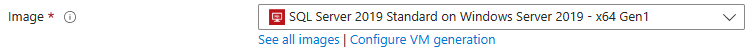
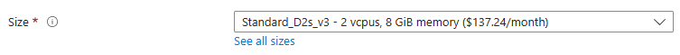
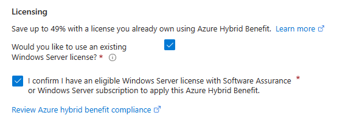
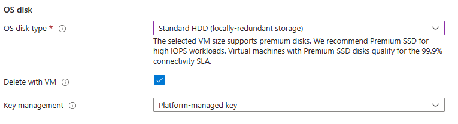
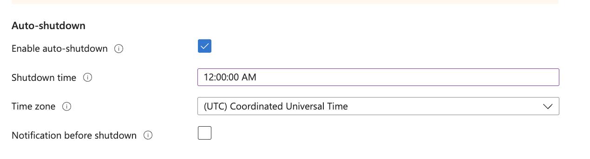
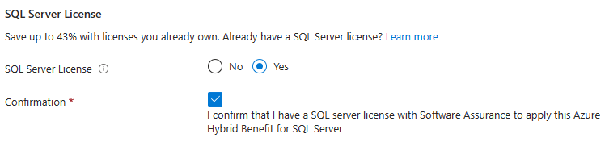
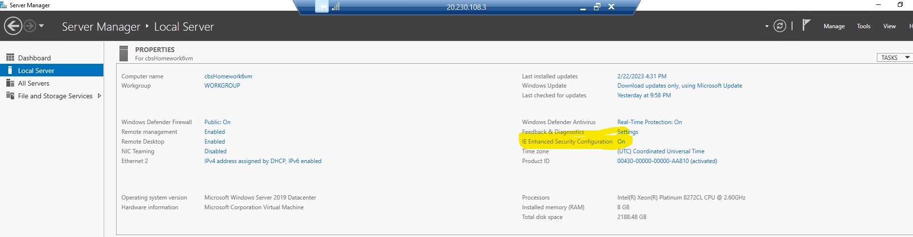
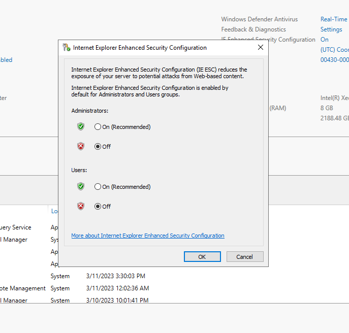
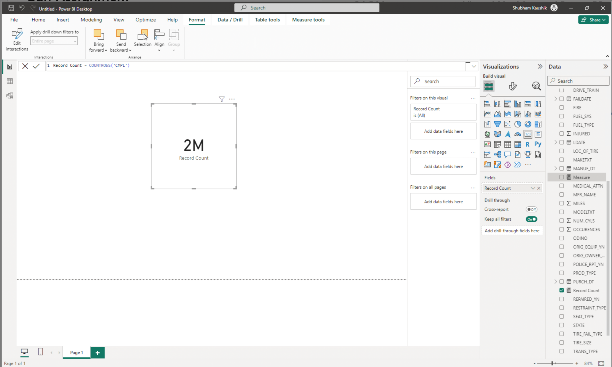
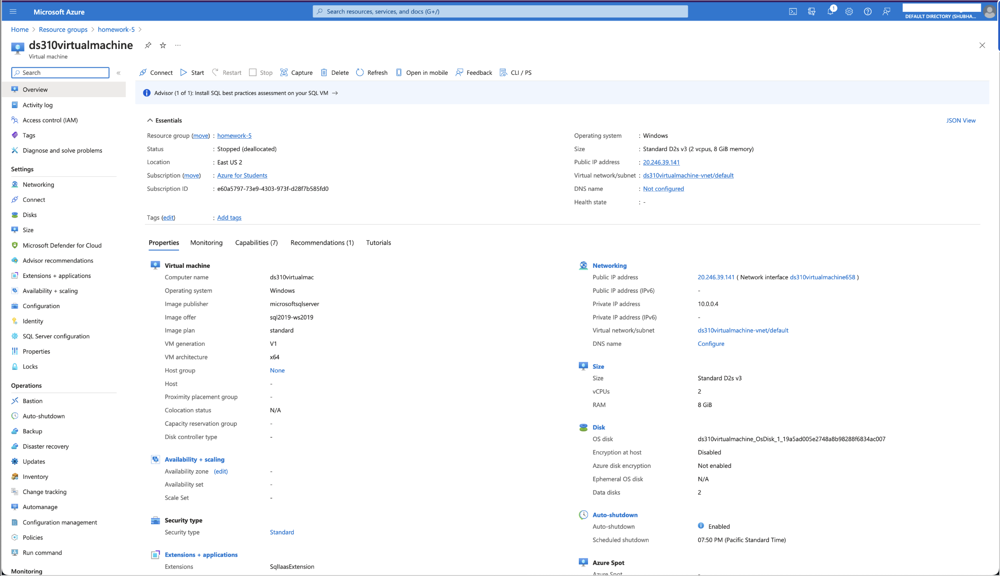

# Homework 5 - Working with Virtual Machines

This guide will walk you through setting up a Windows Virtual Machine (VM) in Azure to use as your environment for Power BI. Read the entire guide before starting to ensure you avoid cost overruns. Incorrect steps may lead to charges beyond your Azure allowance, so it is highly recommended to use the script deployment method rather than manual deployment.

## Prerequisites

Before beginning, ensure you have:

- An active Azure account
- Access to the Azure portal

## Step 1: Create a Windows VM

> **NOTE**: If you prefer not to manually configure the VM, use the `az` command with the provided `template.json` and `parameters.json` files and proceed to Step 2. You do **not** need to run the `formTemplate.sh` script this time.

```azurecli-interactive
az deployment group create --resource-group <resource-group-name> --template-file <path-to-template.json> --parameters @<path-to-parameters.json>
```

Follow the [Quickstart Tutorial](https://learn.microsoft.com/en-us/azure/virtual-machines/windows/quick-create-portal) to create your VM.

### Key Configuration Steps
Ensure you pay attention to the following settings:

1. **Image Selection**: Choose the Windows image recommended in the tutorial.

    
   <style>
      img {
         width: 400px;
      }
   </style>

2. **Virtual Machine Size**: Select `Standard_D2s_v3` for your VM size to balance performance and cost.

    
   <style>
      img {
         width: 400px;
      }
   </style>

3. **Licensing**: If prompted, choose the option indicating you have a trial license. (Skip this if not shown.)

    
   <style>
      img {
         width: 400px;
      }
   </style>

4. **Disks**: Choose `Standard HDD` for the disk type to manage costs.

    
   <style>
      img {
         width: 400px;
      }
   </style>

5. **Management**: Enable the 'Auto-Shutdown' feature to avoid unnecessary charges.

    
   <style>
      img {
         width: 400px;
      }
   </style>

6. **Networking, Monitoring, and Advanced Settings**: Leave the default options.

7. **SQL Server Settings**: Confirm that you have a license.

    
   <style>
      img {
         width: 400px;
      }
   </style>

8. **Review and Create**: Verify your settings and proceed with the VM creation.

## Step 2: Connecting to the Virtual Machine

Once your VM is created, follow the tutorial's instructions to connect to it.

**If you used the template for deployment, use these credentials:**
- **Username**: `omdsmod4admin`
- **Password**: `omdsmod4password013!`

### Important Connection Notes

- **BU Network Users**: Use a VPN as port 3389 is blocked on BU's network.
- **Alternative Option**: Follow this [YouTube video](https://www.youtube.com/watch?v=5_24GbLbOK4) for guidance, but use port **3100** instead of **5432**.
- **Mac Users**: Install the [Microsoft Remote Desktop application](https://apps.apple.com/us/app/microsoft-remote-desktop/id1295203466?mt=12) from the Apple Store for VM access.

## Step 3: Important Post-Configuration Steps

After connecting to your VM, perform the following configurations:

1. **Configure Auto-Shutdown**: Adjust the auto-shutdown time to match your work schedule.
2. **Shut Down Properly**: Use the "Stop" button to shut down the VM when not in use. If prompted, keep the IP address.
3. **Disable IE Enhanced Security Configuration**:
   - In the VM's "Server Manager," turn off the IE Enhanced Security Configuration under the "Local Server" tab.

    
   <style>
      img {
         width: 400px;
      }
   </style>

    
   <style>
      img {
         width: 400px;
      }
   </style>

## Step 4: Install Power BI Desktop

Download and install Power BI Desktop (x64) using your BU email for the trial. [Download Power BI Desktop](https://powerbi.microsoft.com/en-us/desktop/).

### Power BI Steps

1. **Sign In**: Log in to Power BI with your BU email.
2. **Connect to Azure SQL Database**:
   - Connect to your Homework 3 Azure SQL Database.
   - Load the `Complaints` table (or the equivalent table name you created).
3. **Create a Visual**:
   - Build a simple count visualization showing the number of records.
4. **Screenshots**: Capture the required screenshots for submission on Gradescope.

## Additional Notes

- Be mindful of your Azure usage to avoid unexpected charges.
- Save the VM configuration details and connection info for future use.

---

## Verification and Submission

Upon completion, submit the following as proof of your work:

1. **Screenshot of the PowerBI Page** 
   - 
   <style>
      img {
         width: 400px;
      }
   </style>

2. **Screenshot of the Virtual Machine** 
   - 
   <style>
      img {
         width: 400px;
      }
   </style>

Save the screenshots as `.png` or `.jpg` files and upload them through the course submission portal for Homework 1.

---

**Happy working with your Azure VM!**
