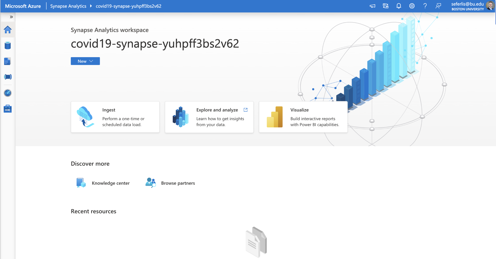

# Homework 6: Azure Synapse Workspace and Parquet Files Creation

## Objective

In this assignment, you will begin working with Azure Synapse Analytics and utilize its SQL Serverless pools powered by a Massively Parallel Processing (MPP) engine. Your task is to prepare your data by converting the NHTSA Complaints File into a `.parquet` format suitable for distributed systems and datasets (sharding). This process simulates the preparation needed to connect to data using Polybase and read directly from the Data Lake. In Homework 7, you will connect to this data as an external table. The main objective of this assignment is to create an Azure Synapse Workspace and partition `.parquet` files by manufacturer name.

## Tasks

### 1. Upgrade Your Storage Account

To link your Synapse Workspace to a storage account, it must be upgraded to ADLS Gen 2. Follow these steps:
- **Enable Hierarchical Namespace**: Navigate to your storage account overview, and under the Data Lake Storage heading, enable the hierarchical namespace option.

### 2. Convert the NHTSA TXT File to Parquet Format

Use Azure Data Factory (ADF) Data Flows to perform the following steps:

1. **Set Up a Data Flow**:
   - Configure the NHTSA TXT file as the data source.

2. **Configure the Sink**:
   - Set the output format to `.parquet`.

3. **Partition the Parquet Files**:
   - Partition the `.parquet` files by the manufacturer name.
   - **Important**: Some manufacturer names may end with a period (.), which is not allowed in storage account names. Use a filter operator in your data flow to exclude these entries.
   - Refer to the [Complaints Reference File](https://static.nhtsa.gov/odi/ffdd/cmpl/Import_Instructions_Excel_All.pdf) for field details.

### 3. Create Your Synapse Workspace

Set up your Azure Synapse Workspace by following these steps:

1. **Create the Synapse Workspace**:
   - Refer to this [tutorial](https://learn.microsoft.com/en-us/azure/synapse-analytics/get-started-create-workspace) for detailed instructions.
   - **Note**: Do not use the sample data provided in the tutorial.

2. **Link Your Storage Account**:
   - In the Data section of the Synapse Workspace, add your storage account as a linked service if not already connected.
   - Ensure the primary storage account is correctly set up as ADLS Gen 2.

### 4. Utilize the Created Parquet File

Ensure the `.parquet` files created from the NHTSA data are accessible in your Synapse Workspace. This will be essential for the subsequent homework.

## Submission

Your submission should include the following:

1. **Screenshot of Your Synapse Workspace**:
   - Ensure the screenshot clearly displays your Synapse Workspace.
   - 

2. **Directory or Storage Container View**:
   - Provide a screenshot showing the directory or storage container view with the partitioned `.parquet` files.
   - The partition names based on the manufacturer name should be clearly visible.
   - 

### Additional Resources
- [Tutorial: Write to a Data Lake](https://learn.microsoft.com/en-us/azure/data-factory/tutorial-data-flow-write-to-lake)

Ensure all steps are completed accurately and verify that the `.parquet` files are correctly partitioned and accessible from your Synapse Workspace. Reach out if you have any questions or need further assistance.
