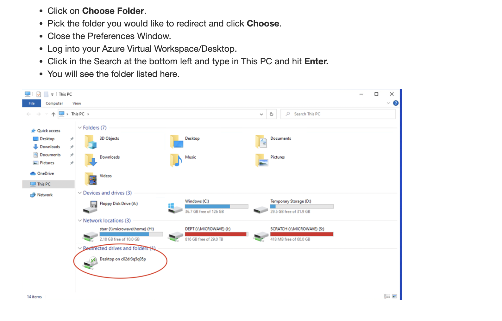
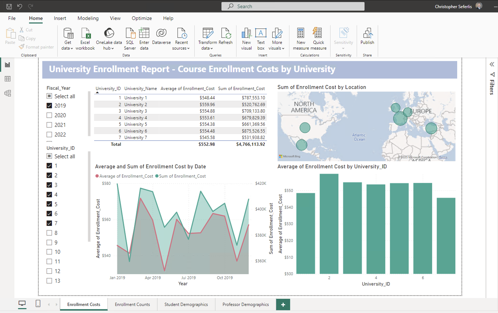
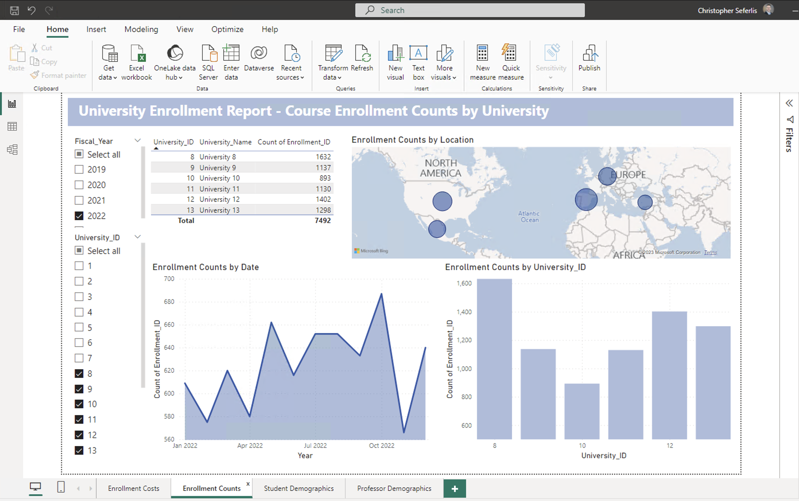
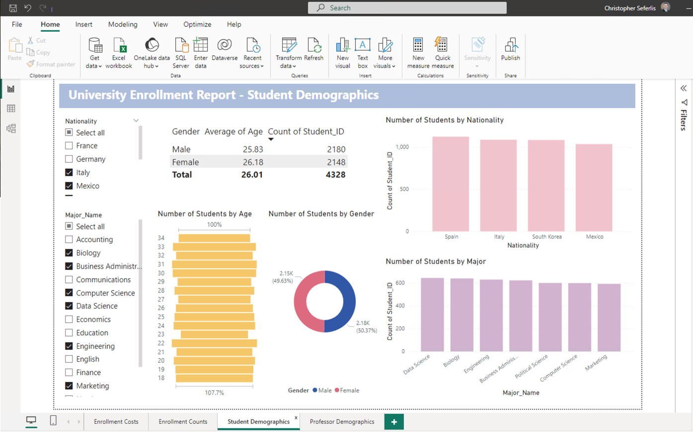
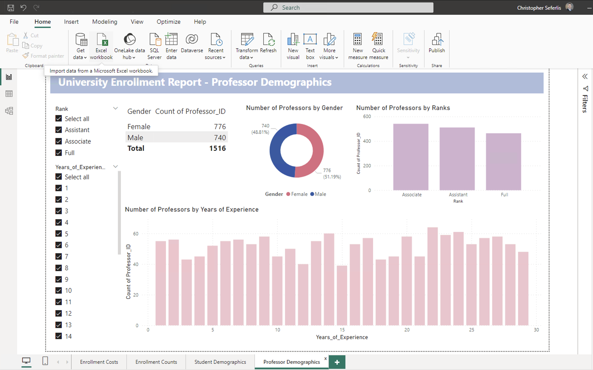
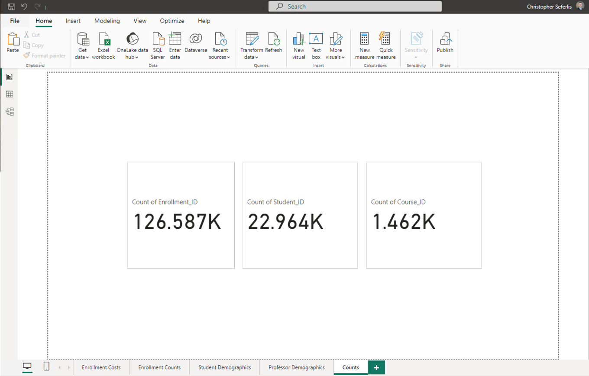
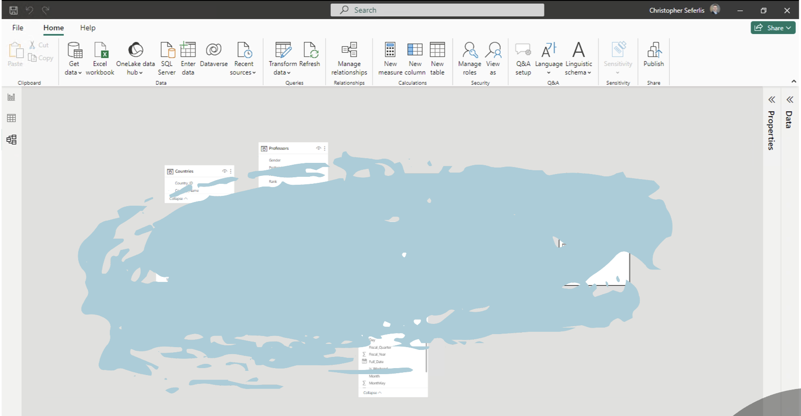

# Homework 8: Microsoft Power BI

## Objective
The purpose of this homework is to familiarize you with the **fundamentals of Power BI**. By the end of this assignment, you will have developed key data visualization skills, an essential capability for any data analyst.

## Tasks

### 1. Execute the Provided Jupyter Notebook to Generate Unique Data
- Download the `hw8.ipynb` file from GitHub and execute it using your preferred local IDE (e.g., Jupyter Notebook) or on Google Colab.

### 2. Access Power BI
#### Windows Users
- **Windows users** should download and install Power BI Desktop on their local machine for use.

#### Mac Users
- **Mac users** can access Power BI via **Azure Virtual Desktop** using the **Remote Desktop Client**. Follow this guide for setup: [Azure Virtual Desktop Connection for macOS](https://learn.microsoft.com/en-us/azure/virtual-desktop/users/connect-macos).

- **Configure Folder Redirection** to enable access to local folders on your virtual machine:
  - Refer to the following tutorial for folder redirection: [Folder Redirection Guide](https://bowdoin.teamdynamix.com/TDClient/1814/Portal/KB/ArticleDet?ID=132977).
    -  

### 3. Create the Final Power BI Report
Refer to the [Power BI Report Creation Tutorial](https://learn.microsoft.com/en-us/power-bi/create-reports/desktop-dimensional-model-report) for assistance.

> **Note**: Since the data is randomly generated, the emphasis should be on the **visual aspects** and the components included in the visuals, not the specific numbers.

Your report should consist of the following interactive pages:

1. **Course Enrollment Costs by University**
   - 

2. **Course Enrollment Counts by University**
   - 

3. **Student Demographics**
   - 

4. **Professor Demographics**
   - 

5. **Total Counts Page**:
   - Display the total counts of **'Enrollment_ID,' 'Student_ID,'** and **'Course_ID.'**
   - 

### Additional Requirements:
- Ensure the layout of each report page matches the provided screenshots.
- Include interactive elements such as slicers or filters to enhance the user experience.

## Submission
Ensure your BU account information is visible in the top right corner of your screenshots for verification.

Your submission should include:

1. **Screenshot of your Snowflake Schema data model**:
   - 

2. **Screenshots of all five report pages**

> **Reminder**: The data will differ due to its random nature. Focus on ensuring the visuals and components are correctly built.

Good luck, and enjoy building your Power BI report!
